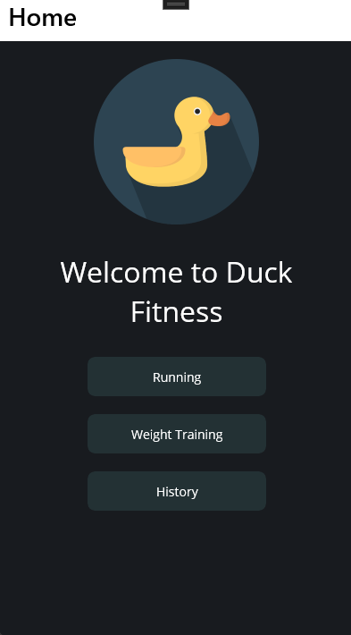
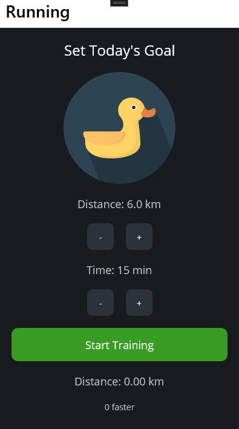
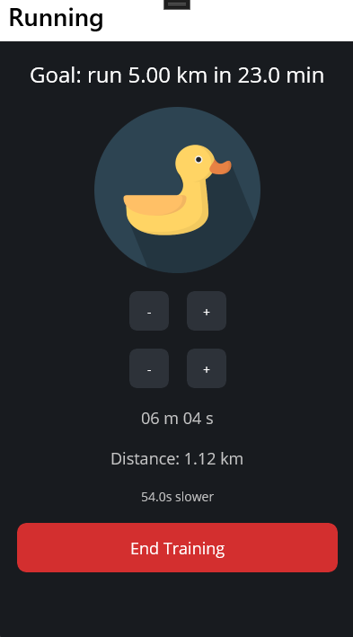
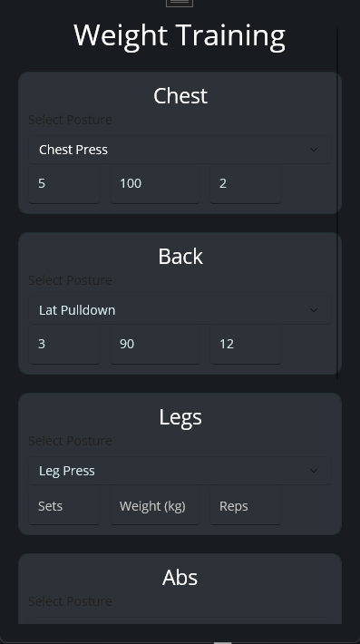

# 🦆 DuckFitness

DuckFitness is a cross-platform fitness tracking app built with .NET MAUI. It helps users set fitness goals, track their running progress, and manage their personal records in weight training. Designed with a sleek and user-friendly UI, DuckFitness motivates you to achieve your fitness goals efficiently.

## ✨ Features

### 1. Running Tracker
- Set distance and time goals for your running sessions.
- Track progress in real-time with:
  - Current distance covered.
  - Time spent.
  - Speed analysis.

### 2. Weight Training Management
- Organize your weight training into categorized sections:
  - Chest
  - Back
  - Legs
  - Shoulders
  - Arms
  - Abs
- Log detailed information for each exercise:
  - Training posture
  - Sets
  - Reps
  - Weights used

### 3. Historical Records
- **Running Records**:
  - Track past running sessions with distance, time, and date.
- **Personal Records (PR)**:
  - Monitor and display your maximum weights and reps for various exercises.
  - Organized by muscle groups and exercises.

## 📱 Screenshots





## 🛠️ Technologies Used
- **.NET MAUI**: For building cross-platform mobile and desktop applications.
- **C#**: For the application logic.
- **XAML**: For designing the user interface.

## 🚀 Getting Started

### Prerequisites
- Install [Visual Studio 2022](https://visualstudio.microsoft.com/) with the .NET MAUI workload.
- Ensure you have the necessary SDKs for Android, iOS, or Windows development.

### Clone the Repository
```bash
git clone https://github.com/yourusername/DuckFitness.git
cd DuckFitness
```
### Build and Run
1. Open the DuckFitness.sln file in Visual Studio.
2. Choose your target platform (e.g., Android, iOS, Windows).
3. Click Run to start the application.

### Project Structure
```bash
DuckFitness/
├── Models/          # Data models
├── Views/           # XAML pages for the app's UI
├── ViewModels/      # MVVM ViewModel logic
├── Resources/       # Images, styles, and other assets
└── App.xaml         # Application-wide settings

